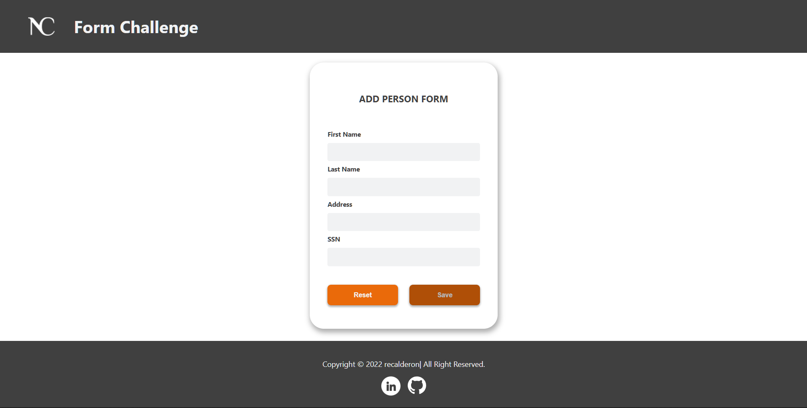
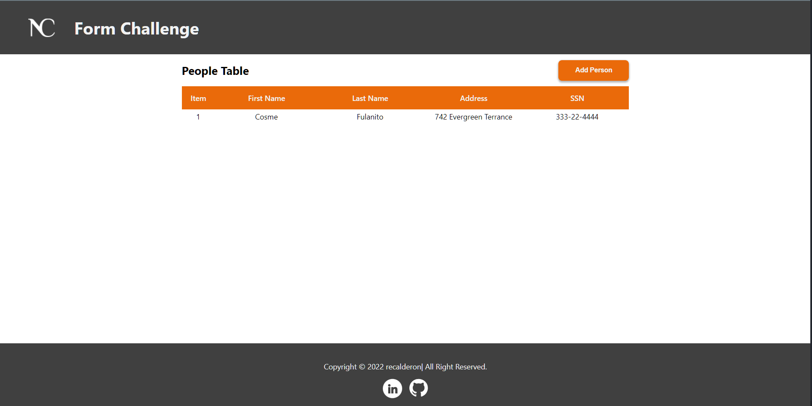

#   Form Challenge 
---
This project was bootstrapped with [Create React App](https://github.com/facebook/create-react-app).

## Libraries Used
- [React Router](https://reactrouter.com/)
- [Axios](https://axios-http.com/docs/intro)
- [Serve](https://github.com/vercel/serve#readme)
- [Concurrently](https://github.com/open-cli-tools/concurrently#readme)

## Available Scripts

Extends the Create React App Available Scripts

- At the root
### `npm run serve:custom`
- Inside ./app
### `npm run build:custom`

## How To Use?
- Fork the Github repository:

```bash
  git clone https://github.com/recalderon93/devskillsadv.git
```

- Move to the Folder

```bash
  cd devskillsadv
```

- Execute the custom script:

```bash 
  npm run serve:custom
```

- This command will execute the following logic:

```bash
  npm install
  concurrently \"node index.js\" \"cd app && npm run build:custom\"
  npm install
  react-scripts build
  serve -s build | echo \"APP IS READY TO USE AT http://localhost:3000\"
```

- Then Open your browser at http://localhost:3000

## Views
### Home Tab


<br />
<br />

### Table Tab



